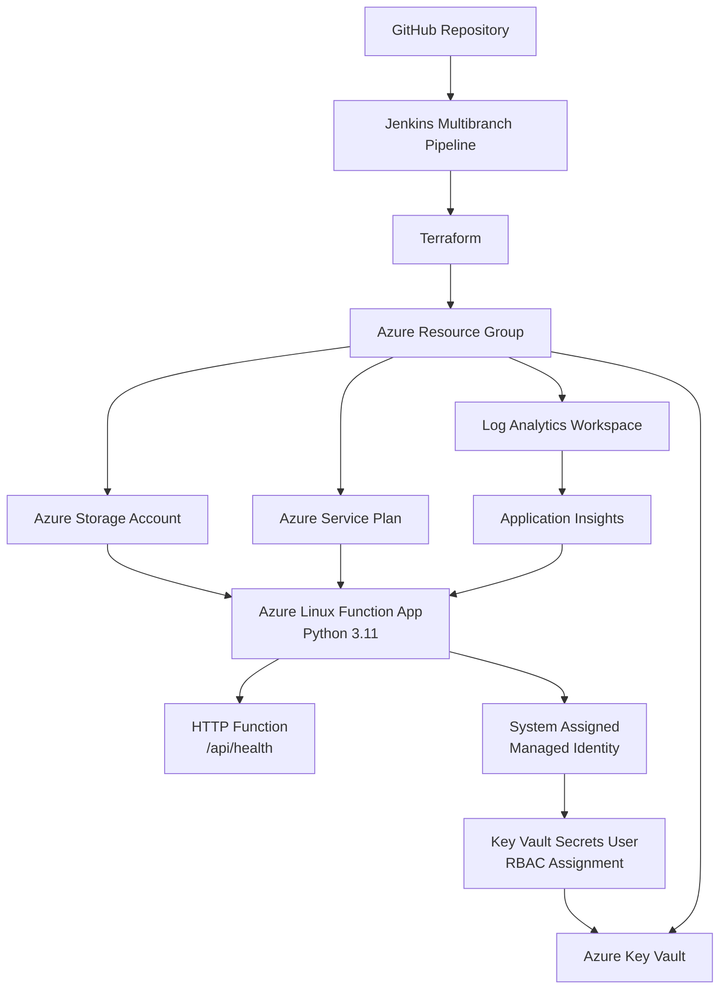

# Azure Serverless Platform

> **Status:** 🚧 Work in Progress

A modular Azure Serverless Platform built with Terraform and Jenkins, focusing on Infrastructure as Code, CI validation, security, observability, and practical Azure architecture.

---

## Overview

This repository demonstrates the incremental development of an Azure serverless platform using Terraform.

The project combines infrastructure provisioning, serverless compute, observability, managed identities, role-based access control, and Jenkins-based Continuous Integration.

The infrastructure is intentionally developed through feature branches and pull requests to document the engineering process and demonstrate practical DevOps workflows.

---

## Architecture



---

## Current Infrastructure

The platform currently includes:

* Azure Resource Group
* Azure Storage Account
* Azure Service Plan
* Azure Linux Function App
* Python 3.11 Function runtime
* HTTP health endpoint
* Log Analytics Workspace
* Application Insights
* System-assigned Managed Identity
* Azure Key Vault
* Azure RBAC role assignment
* Modular Terraform architecture

---

## Serverless Workload

The repository contains a small Python-based Azure Function application.

The application intentionally remains minimal because the focus of this project is Cloud and DevOps engineering rather than application development.

Current endpoint:

```text
GET /api/health
```

Example response:

```json
{
  "status": "healthy",
  "service": "serverless-api"
}
```

The workload provides a real application target for infrastructure, CI/CD, monitoring, and security integration.

---

## Terraform Architecture

Infrastructure is separated into reusable Terraform modules.

```text
.
├── app/
│   ├── function_app.py
│   ├── host.json
│   └── requirements.txt
│
├── modules/
│   ├── application-insights/
│   ├── function-app/
│   ├── key-vault/
│   ├── resource-group/
│   └── storage-account/
│
├── Jenkinsfile
├── main.tf
├── providers.tf
├── variables.tf
├── versions.tf
└── README.md
```

Terraform module dependencies are connected through explicit inputs and outputs.

Example:

```text
Function App
    │
    │ Managed Identity Principal ID
    ↓
Function App Output
    ↓
Root Module
    ↓
Key Vault Module
    ↓
Azure RBAC Role Assignment
```

This keeps individual modules isolated and reusable while allowing the root module to orchestrate dependencies.

---

## Security

Security is implemented using Azure-native identity and authorization mechanisms.

### Managed Identity

The Azure Function App uses a system-assigned Managed Identity.

This provides the Function App with an identity in Microsoft Entra ID without storing usernames, passwords, or client secrets in the application.

```text
Azure Function
      ↓
Managed Identity
      ↓
Microsoft Entra ID
```

### Key Vault

Azure Key Vault is provisioned using Terraform with Azure RBAC enabled.

The Function App Managed Identity receives the following role:

```text
Key Vault Secrets User
```

The relationship is created using the Function App's Managed Identity `principal_id`.

```text
Function App
     ↓
Managed Identity
     ↓
Principal ID
     ↓
Azure RBAC
     ↓
Key Vault
```

No real secrets, passwords, API keys, or cloud credentials are stored in this repository.

---

## Observability

The platform includes Azure-native observability components.

### Log Analytics Workspace

A Log Analytics Workspace provides centralized storage and querying for Azure telemetry.

### Application Insights

Application Insights is connected to the Azure Function App using its connection string.

This architecture provides the foundation for monitoring:

* HTTP requests
* Response times
* Application failures
* Exceptions
* Function execution telemetry
* Application logs

```text
Azure Function
      ↓
Application Insights
      ↓
Log Analytics Workspace
```

---

## Continuous Integration

Jenkins is used as the current CI platform.

Jenkins runs locally inside Docker using a custom image with Terraform installed.

The repository uses a Jenkins Multibranch Pipeline that discovers branches and pull requests from GitHub.

Current pipeline:

```text
GitHub Pull Request
        ↓
Jenkins Multibranch Pipeline
        ↓
Terraform Init
        ↓
Terraform Format Check
        ↓
Terraform Validate
        ↓
Build Metadata Artifact
        ↓
Workspace Cleanup
        ↓
Build Status returned to GitHub
```

The Terraform Format and Validate stages run in parallel.

Jenkins build results are reported back to GitHub and appear directly as Pull Request status checks.

The repository is currently scanned manually from Jenkins rather than using automatic webhook triggers. This is intentional while the Jenkins workflow and Multibranch Pipeline behavior are being actively explored.

---

## Git Workflow

Infrastructure changes are developed using feature branches and pull requests.

Typical workflow:

```text
main
  ↓
feature/*
  ↓
Development
  ↓
terraform fmt
  ↓
terraform validate
  ↓
Commit
  ↓
Push
  ↓
Pull Request
  ↓
Jenkins CI
  ↓
Successful Build
  ↓
Merge into main
```

Feature branches are removed after successful integration.

This keeps the `main` branch stable and provides a visible history of infrastructure changes.

---

## Deployment Policy

This project currently follows a validation-first deployment policy.

Terraform commands used during development and CI include:

```bash
terraform init
terraform fmt
terraform validate
```

`terraform apply` is intentionally not executed as part of the current project workflow.

This prevents unnecessary Azure consumption costs while allowing the repository to demonstrate:

* Terraform architecture
* Azure resource relationships
* Infrastructure as Code
* CI validation
* Security design
* Observability design
* Git workflows
* Jenkins integration

A controlled `terraform plan` stage with secure Azure authentication is planned as a future improvement.

---

## Cost Controls

The platform is designed with cost awareness in mind.

Current design decisions include:

* Azure Functions Consumption-oriented hosting
* No permanently deployed Azure environment
* No automated `terraform apply`
* No automatically provisioned production workloads
* Validation-focused CI
* Infrastructure designed before deployment

This allows the project to demonstrate realistic Azure architecture without maintaining continuously running cloud resources.

---

## Technologies

* Microsoft Azure
* Terraform
* Jenkins
* Docker
* Git
* GitHub
* Python
* Microsoft Entra ID
* Azure Key Vault
* Azure RBAC
* Azure Functions
* Application Insights
* Log Analytics

---

## Current Engineering Focus

The platform currently demonstrates four main areas:

### Infrastructure

```text
Terraform
→ Modular Azure resources
→ Serverless compute
```

### Security

```text
Managed Identity
→ Azure RBAC
→ Key Vault
```

### Observability

```text
Azure Function
→ Application Insights
→ Log Analytics
```

### Continuous Integration

```text
Feature Branch
→ Pull Request
→ Jenkins
→ Terraform Validation
→ GitHub Status Check
```

---

## Planned Improvements

Future improvements may include:

* Secure Azure authentication for Jenkins
* Terraform Plan execution in CI
* Secretless authentication using workload identity where appropriate
* Additional application monitoring
* Alerting
* Improved CI quality gates
* Controlled deployment stages
* Architecture documentation
* Environment-specific configuration
* Additional serverless Azure integrations

---

## Disclaimer

This repository is a public Cloud/DevOps portfolio project and is under active development.

It demonstrates Infrastructure as Code, Azure architecture, CI workflows, security, and observability patterns.

The repository does not currently represent a permanently deployed production environment, and no automated infrastructure deployment is performed.
